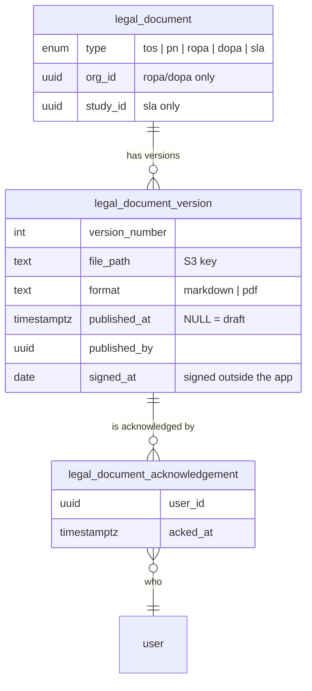

# Legal Documents (ToS / PN / ROPA / DOPA / SLA) — Design

**Epic:** [SHRMP-273 — Agreements and ToS/PN](https://openstax.atlassian.net/browse/SHRMP-273)
**Status and remaining work:** `2026-07-27-legal-documents-plan.md` (this doc carries no status, so
the two cannot drift)

---

## 1. What we're building and why

SafeInsights needs to **house, version, present, and capture acknowledgement of** five kinds of
legal document. We are explicitly _not_ building signing — signatures happen outside the app
(Zoho Sign), facilitated manually by an SI admin.

| Document                                        | Who it covers                | Scope     | Format   |
| ----------------------------------------------- | ---------------------------- | --------- | -------- |
| **ToS** — Terms of Service                      | Everyone                     | Global    | Markdown |
| **PN** — Privacy Notice                         | Everyone                     | Global    | Markdown |
| **ROPA** — Research Org Participation Agreement | Members of one Research Lab  | Per-org   | PDF      |
| **DOPA** — Data Org Participation Agreement     | Members of one Data Partner  | Per-org   | PDF      |
| **SLA** — Study Level Agreement                 | People who work on one study | Per-study | PDF      |

The compliance requirement is the point: we must be able to **produce evidence** that a specific
person agreed to a specific version of a specific document on a specific date.

**On "O" in ROPA/DOPA.** The acronyms expand with **O**rganization, the historic name for what the
app now calls a Partner. An earlier draft argued for renaming the agreements to "Partner"; that was
reversed. The executed PDFs carry "Organization" on their cover, and an SI admin matching a signed
file to a tab is better served by the document's own name. So `legalDocumentTypeLabels` reads
"Research/Data Organization Participation Agreement", while `participationAgreementOrgLabels` is a
separate map for the table column and picker, where the app's current noun is correct.

---

## 2. The model

Three tables. The shape is the same for all five types; only _scope_ and _format_ differ.

**`legal_document`** is the _logical_ document — "the Terms of Service", "Acme Lab's ROPA". One per
scope, enforced by a unique constraint. Holds no content.

**`legal_document_version`** is an uploaded file. A version is a **draft** until published
(`published_at IS NULL`); publishing stamps the date, publisher and next version number together,
which a CHECK enforces so no half-published row can exist for read paths to trip over.

**`legal_document_acknowledgement`** is one row per (person, version). Its existence _is_ the
evidence.

Scope is expressed by which columns are set, with a CHECK per type:

| Type           | `org_id`     | `study_id`   |
| -------------- | ------------ | ------------ |
| `tos`, `pn`    | null         | null         |
| `ropa`, `dopa` | **required** | null         |
| `sla`          | null         | **required** |

The migration is `src/database/migrations/1785860103751_legal_documents.ts`; its inline comments
carry the reasoning for each non-obvious constraint.

---

## 3. Key decisions

**One general model rather than a table per document type.** All five are "a versioned file plus a
record of who agreed to it", differing only in scope and format. The main cost — a Postgres enum
that is annoying to extend — is paid once.

**Nothing stored that can be derived.** An SLA stores only `study_id`: `study.orgId` is the
enclave / Data Partner and `study.submittedByOrgId` is the lab / Research Lab, so both are one join
away. A stored copy is a second source of truth that can drift.

**Who must acknowledge is a query, not a table.** No materialised "pending" rows at publish time.
Audience is derived per type: ToS/PN → all users; ROPA/DOPA → that org's members; SLA → members of
the study's two orgs. This matters most for SLAs, where the audience changes as people join an org.
Absence of an acknowledgement row means pending.

**Acknowledgements point at a version, not a document,** so "which version did they agree to" is an
exact answer.

**Publishing is irreversible; drafts are replaceable.** A published version is never edited,
deleted or unpublished — a mistake is fixed by publishing a corrected version, and everyone
re-acknowledges, which is the correct outcome. Only one draft may exist per document. No retraction
column; it can be added if legal asks.

**Content lives in S3, not the database.** Consistent with every other document in the app.
Immutable versions mean content can be cached indefinitely.

**Named `legal_document`, not `agreement`.** "Agreement" is already taken by the unrelated
DUA/IRB/SOW wizard (`study.agreementDocPath`, `/study/[studyId]/agreements/`). It is also more
accurate: a Privacy _Notice_ is not an agreement.

**Two date fields that mean different things.** `published_at` is when it went live in the app
(system-set, drives enforcement). `signed_at` is the calendar day a signatory physically signed
outside the app (admin-entered, ROPA/DOPA/SLA only). It is a `date`, not a timestamp: a signing day
has no time-of-day, and storing an instant would display as the previous day west of the stored
zone.

**No generic audit-log integration.** These tables _are_ the compliance record. Writing the same
facts to the `audit` table invites the two disagreeing.

### Enforcement (SHRMP-275)

**A user owes a document when its latest published version has no acknowledgement row from them.**
Superseded versions are never backfilled — the obligation is to the terms in force. This is also
what the SI-admin audit list computes, so the two views cannot disagree. "Never acknowledged" and
"was updated" are the same query; they differ only in copy, keyed on whether any prior version was
acknowledged.

**The gate is presence-based, not login-event-based.** `RequireLegalAcknowledgement` sits in
`AppShell` beside `RequireMFA` and `RequireUserKey`, so it also catches a user who was already
signed in when a document was published and never logs in again. `/account/*` renders outside
`AppShell`, which leaves MFA enrolment and key setup unblocked with no per-route wiring.

**It is a UX gate, not enforcement.** Client-side, so devtools defeats it. Accepted: the compliance
artifact is the acknowledgement row, not the blocking, and MFA/user-key already have this property.
Server-side rejection of mutations from users who owe an acknowledgement would be a much larger
change.

**One modal, one checkbox, copy derived from what is pending.** Non-dismissable — no close button,
no escape, no click-outside — with an explicit **Sign out** as the alternative to agreeing.
Declining is a legitimate choice, and without that button the modal covers the nav and the only way
out is closing the tab, which leaves the session intact.

**Signup records the acknowledgement against the versions the form displayed,** not "whatever is
latest now". If a new version publishes between page load and submit, we record what the user was
shown and the gate collects the newer one. Before anything is published the signup checkbox falls
back to placeholder copy and records nothing — `legal_document_version_id` is NOT NULL, so an
acknowledgement of a non-existent document is impossible by construction.

**`acknowledge` is granted unconditioned to every signed-in user.** It is the user asserting
something about themselves, the row is keyed to `session.user.id`, and the action refuses
unpublished versions. `view` is deliberately not widened, since that would hand ordinary users the
SI-admin audit listings.

---

## 4. Gotchas

- **`deferred()` is fire-and-forget** (`src/server/events.ts`) with no retry, timeout or state — it
  is what silently lost AI code-review jobs. Publishes and acknowledgements must be synchronous and
  transactional. Only emails belong there.
- **`performsMutations: true` already wraps the handler in a transaction** (`action.ts`). Do not
  open one by hand.
- **`UNIQUE NULLS NOT DISTINCT`** — without it Postgres allows unlimited `('tos', NULL, NULL)` rows.
- **`study.orgId` is the Data Partner; `study.submittedByOrgId` is the Research Lab.** Trivially
  easy to invert.
- **`signed_at` is a `date`, which node-postgres reads back as a local-midnight `Date`.** Every read
  path casts it with `signed_at::text` instead. Keep doing that, or register an OID 1082 parser.
- **`createSignedUploadUrl` takes a directory prefix, not a key** — S3 appends the client's
  filename. Each version uploads under a prefix containing its own id, and `file_path` is built from
  the same `fileName` the client sends.
- **All-optional ability conditions are weak types.** An action whose params share no property with
  `{ orgId?, studyId? }` fails to compile with a confusing `type 'never'` error. Add a middleware
  supplying the scope rather than loosening the ability type — `scopeFromVersionId` does this, and
  it makes a future "org admin publishes only their own org's agreements" rule free.
- **ToS/PN are globally scoped, so no e2e test may publish one.** There is exactly one `tos` and one
  `pn` row ever, and publishing makes every user owe an acknowledgement — which under
  `fullyParallel` at `retries: 0` blocks every other worker mid-run. All ToS/PN test state is seeded
  once in `tests/global.setup.ts`, and lives in `tests/e2e.seed.ts` rather than
  `src/database/seeds/` because those also run in deployed environments via the migrator Lambda.
- **Mocking `@/server/aws` does not reach `src/server/storage.ts`.** The vitest setup file
  transitively imports storage before any test's `vi.mock` registers, so storage keeps the real
  binding. Stub the module the code actually calls. Being fixed separately.
- **The epic ships to `main` as one unit**, so the migration is amended in place rather than stacked
  with corrective migrations. `allowUnorderedMigrations: true` is set in `kysely.config.ts`.
