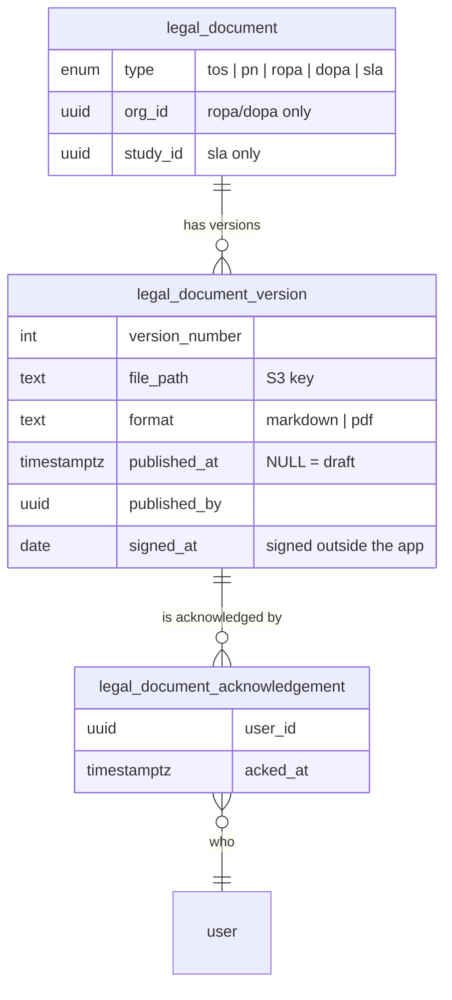

# Legal Documents (ToS / PN / ROPA / DOPA / SLA) — Design

**Date:** 2026-07-27
**Project:** SafeInsights management-app
**Epic:** [SHRMP-273 — Agreements and ToS/PN](https://openstax.atlassian.net/browse/SHRMP-273)
**Status:** Implemented as described — schema, server actions and tests are on
`SHRMP-274/instantiate-legal-page`. Task-level detail, deviations and remaining work:
`2026-07-27-legal-documents-plan.md`

---

## 1. What we're building and why

SafeInsights needs to **house, version, present, and capture acknowledgement of** five kinds of
legal document. We are explicitly _not_ building signing — signatures happen outside the app
(Zoho Sign), facilitated manually by an SI admin.

| Document                                        | Who it covers                | Scope     | Format   |
| ----------------------------------------------- | ---------------------------- | --------- | -------- |
| **ToS** — Terms of Service                      | Everyone                     | Global    | Markdown |
| **PN** — Privacy Notice                         | Everyone                     | Global    | Markdown |
| **ROPA** — Research Org Participation Agreement | Members of one Research Lab  | Per-org   | PDF      |
| **DOPA** — Data Org Participation Agreement     | Members of one Data Partner  | Per-org   | PDF      |
| **SLA** — Study Level Agreement                 | People who work on one study | Per-study | PDF      |

> **On "O" in ROPA/DOPA.** The acronyms expand with **O**rganization, which is also the historic
> name for what the app now calls a Partner. An earlier draft of this doc argued for renaming the
> agreements to "Partner" to match the rest of the product; that was reversed. The executed PDFs
> carry "Organization" on their cover, and an SI admin matching a signed file to a tab is better
> served by the document's own name than by our internal noun. So `legalDocumentTypeLabels`
> (`src/schema/legal-document.ts`) reads **"Research/Data Organization Participation Agreement"**.
>
> The distinction that survives: the _agreement_ is named after the Organization, the _org_ is
> still a Data Partner or Research Lab. That is why `participationAgreementOrgLabels` is a separate
> map — it labels the table column and the picker, where the app's current noun is correct.

The compliance requirement is the point: we must be able to **produce evidence** that a specific
person agreed to a specific version of a specific document on a specific date.

### The four cards

| Card                                                         | What                                                                                                   | Depends on     |
| ------------------------------------------------------------ | ------------------------------------------------------------------------------------------------------ | -------------- |
| [SHRMP-274](https://openstax.atlassian.net/browse/SHRMP-274) | SI Admin **Legal page**: upload + publish ToS/PN, version history, per-user acknowledgement audit list | — (foundation) |
| [SHRMP-275](https://openstax.atlassian.net/browse/SHRMP-275) | Login **enforcement modal** when ToS/PN is new or unacknowledged                                       | 274            |
| [SHRMP-276](https://openstax.atlassian.net/browse/SHRMP-276) | DOPA + ROPA tabs on the Legal page                                                                     | 274            |
| [SHRMP-277](https://openstax.atlassian.net/browse/SHRMP-277) | SLA tab on the Legal page                                                                              | 274, 276       |

There is also a v1 hand-off doc with a broader set of goals (a user-facing "Legal" sidebar page,
org-admin views, banners, Mailgun triggers). **The cards are the source of truth** — the doc is
historical context. Most of the user-facing work is still in UX and not yet carded.

---

## 2. What already exists (and what doesn't)

Findings from reading the codebase — a few of these are load-bearing:

**There is no acknowledgement system today.** Nothing in the app records that a user agreed to
anything. The closest thing is two timestamp columns on `study`
(`researcher_agreements_acked_at` / `reviewer_agreements_acked_at`) that act as a wizard gate for
the placeholder DUA/IRB/SOW page — a different document set, and marked "under construction".

**The signup checkbox is not persisted.** `src/components/terms-checkbox.tsx` renders
_"I agree to the Terms of Service and Privacy Notice"_, and
`src/app/account/invitation/[inviteId]/signup/page.tsx` holds the result in `useState` where it
only enables the Submit button. Users are affirmatively agreeing today and **we keep no record of
it.** That is precisely the gap this epic closes. (Upside: no legacy data to migrate.)

**A study already knows both of its organizations.** This one is easy to get backwards:

- `study.orgId` → the **enclave / Data Partner** (the _reviewing_ org)
- `study.submittedByOrgId` → the **lab / Research Lab** (NOT NULL)

So an SLA needs to store only `study_id`; both orgs are one join away.

**File storage is a solved problem.** `src/server/aws.ts` has S3 upload, presigned POST upload, and
presigned GET download. Storing an S3 key in a text column is the established pattern
(`study.irbDocPath`, `descriptionDocPath`, `agreementDocPath`). `react-markdown` is already a
dependency. There is no PDF viewer — links will do, and that matches what the cards ask for.

---

## 3. The model

Three tables. The shape is the same for all five document types; only _scope_ and _format_ differ.

**`legal_document`** is the _logical_ document — "the Terms of Service", "Acme Lab's ROPA",
"study X's SLA". There is exactly one per scope, enforced by a unique constraint. It holds no
content itself.

**`legal_document_version`** is an actual uploaded file. A document accumulates versions over time.
A version is a **draft** until published (`published_at IS NULL`); publishing stamps the date,
the publisher, and the next version number — all three together, which a CHECK constraint enforces so
a half-published row cannot exist for read paths to trip over.

**`legal_document_acknowledgement`** is one row per (person, version). Its existence _is_ the
compliance evidence.

### How scope works

A document's scope is expressed by which columns are set, with a database CHECK constraint per
type so it cannot be recorded wrong:

| Type           | `org_id`     | `study_id`   |
| -------------- | ------------ | ------------ |
| `tos`, `pn`    | null         | null         |
| `ropa`, `dopa` | **required** | null         |
| `sla`          | null         | **required** |

---

## 4. Key decisions

Each of these was argued through; the reasoning matters more than the conclusion.

**One general model rather than separate tables per document type.**
All five are "a versioned file plus a record of who agreed to it." They differ only in scope and
format. Building ToS/PN-only now would mean a painful reshape when 276/277 land. The main cost
of generalising — a Postgres enum that is annoying to extend — is paid once, now.

**Nothing is stored that can be derived.**
The SLA table does _not_ store the Research Lab or Data Partner: both live on `study` already, so
we join. A stored copy is a second source of truth that can drift. Same reasoning applies to
"who is required to acknowledge this" — see below.

**Who must acknowledge is a query, not a table.**
We do not materialise "pending acknowledgement" rows when a document is published. The audience is
derived per type: ToS/PN → all users; ROPA/DOPA → that org's members via `orgUser`; SLA → members
of the study's two orgs. This matters most for SLAs, where the hand-off doc says acknowledgement is
triggered by _anyone who loads that study_ — a set materialised at publish time would be wrong the
moment someone joins an org. Absence of an acknowledgement row means "pending".

**Acknowledgements point at a version, not a document.**
Card 274 requires showing _"the version of the ToS and PN they have agreed to"_. Pointing at an
immutable version makes that an exact legal record.

**Publishing is irreversible; drafts are replaceable.**
The card's own copy is _"This cannot be undone."_ A published version can never be edited, deleted,
or unpublished — a mistake is fixed by publishing a corrected new version, and the history shows
both. Everyone then re-acknowledges, which is the correct outcome. An unpublished draft, by
contrast, can be freely replaced (wrong file uploaded → just upload again); only one draft may
exist per document at a time. There is no retraction column; it can be added later if legal asks.

**Content lives in S3, not the database.**
Consistent with every other document in the app. Card 274 asks for a _"latest linked copy"_ — a
presigned S3 URL is literally that link. Because published versions are immutable, their content
can be cached indefinitely.

**Named `legal_document`, not `agreement`.**
"Agreement" is already taken in this codebase by the unrelated DUA/IRB/SOW wizard concept
(`study.agreementDocPath`, `/study/[studyId]/agreements/`), and reusing it would make two unrelated
systems easy to confuse. "Legal document" is also more accurate: a Privacy _Notice_ is not an
agreement. It matches the UI too — the admin route is `/admin/safeinsights/legal`.

**Two date fields that mean different things.**
`published_at` is when the document went live in the app (system-set, drives enforcement).
`signed_at` is the calendar day a signatory physically signed it outside the app (admin-entered,
ROPA/DOPA/SLA only). It is a `date` rather than a timestamp on purpose: a signing day has no
time-of-day or timezone, and storing it as an instant would make it display as the previous day for
viewers in western timezones.

**No generic audit-log integration.**
The app has an `audit` table, but these tables _are_ the compliance record — `published_at` /
`published_by` say who published what when, and acknowledgement rows are the evidence. Writing the
same facts to a second place invites the two disagreeing. Can be added if PMs ask for unified
activity reporting.

---

## 5. What this pass delivered

Foundation only — the database schema and the server-side operations, so UI work has a real API to
build against.

**Delivered**

- The three tables and the type enum.
- Server actions: create a draft (with upload URL), publish a version, list versions with
  history/links, list users with their acknowledgement status, record an acknowledgement.
- A `LegalDocument` permission subject, S3 path builders, and 20 unit tests.

**Deliberately deferred**

- **The login enforcement modal** (SHRMP-275) — the acknowledgement _write_ exists; the flow that
  triggers it does not.
- **Permission rules for non-SI-admins.** Only the `LegalDocument` _subject_ was added; SI admins
  reach these actions through their existing `('manage','all')` wildcard. Granting ordinary users the
  right to acknowledge is a change to `permissions.ts` itself and is needed before 275 can work.
- **Wiring the signup checkbox** to actually persist. It is uncarded (ToS/PN Goal 3), touches a
  sensitive invitation flow, and is a no-op until a real ToS is published. Worth flagging to PMs:
  it is the cheapest way to make 274's audit list contain real data, since signup is the primary
  acknowledgement moment.
- Everything in 276/277 beyond the schema support (`signed_at`, the scope columns) already being
  present.

**Known consequence:** until 275 or the signup wiring lands, the audit list will legitimately show
"none" for every user. That is expected, not a bug.

---

## 6. Open questions

1. **Does the SLA supersede the DUA section** of the study agreements page? Both are study-level
   agreements, and the DUA/IRB/SOW page is still a placeholder. Needs a product answer before 277.
2. **Should the signup checkbox be persisted now?** See above — small, valuable, but out of card
   scope.
3. **How should an SI admin actually verify compliance?** The hand-off doc asks the engineering
   team to propose a process someone could follow to produce a compliance report. Not yet designed.
4. **ToS/PN Goals 3 and 5 are uncarded** (real links at signup; user-facing Legal page). Gap or
   intentional?

---

## 7. Notes for reviewers

- The schema is deliberately built for all five document types even though only ToS/PN is being
  used now. Adding columns later is cheap; reshaping an enum and backfilling is not.
- Because the epic ships to `main` as one unit, the migration can be **amended in place** as
  276/277 teach us things, rather than stacked with corrective migrations.
- One implementation rule worth stating loudly: acknowledgement writes and publishes must be
  **synchronous and transactional**. The `deferred()` helper in `src/server/events.ts` is
  fire-and-forget with no retry — it is what silently lost AI code-review jobs. Only genuinely
  optional side effects (emails) belong there.
